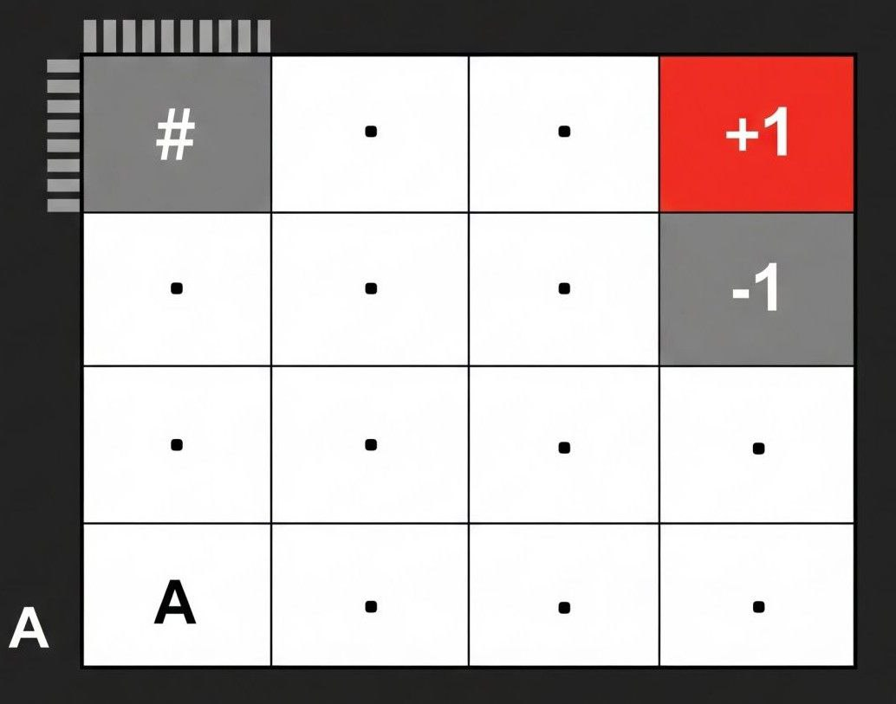

# Introduction to Reinforcement Learning 

All right, welcome to my repository! In this repo I try to explain Reinforcement Learning to people who are interested in this field, but get scared by the massive amount of equations. I try to make the learning as intuitive as possible to create a deeper understanding of the topic. I hope that by the end of all lessons, you will understand what RL is, more importantly how it works, and how it can be applied. Okay, shall we start?

# Table of Contents

1. [Introduction to Reinforcement Learning](#introduction-to-reinforcement-learning)
2. [Reinforcement Learning (RL)](#reinforcement-learning-rl)
3. [Notation](#notation)
4. [Example](#example)
5. [Cross Entropy Method (CEM)](#cross-entropy-method-cem)
   - [From Dictionaries to Neural Networks: Why We Need a Smarter Policy](#from-dictionaries-to-neural-networks-why-we-need-a-smarter-policy)
   - [The CEM Algorithm in Detail](#the-cem-algorithm-in-detail)
   - [Problems with CEM](#problems-with-cem)
6. [A Different Approach: Evolution Strategies (ES)](#a-different-approach-evolution-strategies-es)
   - [The Core Idea: Learning Through Evolution](#the-core-idea-learning-through-evolution)
   - [The ES Algorithm Step by Step](#the-es-algorithm-step-by-step)
   - [Why is ES a Powerful Idea?](#why-is-es-a-powerful-idea)
   - [Problems with ES](#problems-with-es)
7. [Other Black-Box and Evolutionary Approaches](#other-black-box-and-evolutionary-approaches)
   - [Genetic Algorithms (GAs)](#genetic-algorithms-gas)
   - [Particle Swarm Optimization (PSO)](#particle-swarm-optimization-pso)
   - [Novelty Search](#novelty-search)

# Reinforcement Learning (RL)

Reinforcement learning is formally a sub-field of Machine Learning (ML). For those who aren't familiar with ML, here's a helpful way to think about it. For long decades practioners used a pre-defined sequence of logical checks to solve problems. For example, a robot on an assembly line is programmed with a precise sequence of movements: pick up part A, rotate 90 degrees, place it on part B. If a part is misaligned, the robot cannot adapt. To improve it people started developing algorithms that would allow machines to change their behavior or in other words to *learn*. 

Learning does not happen magically; this process requires some data. This data is used by algorithms to develop some rule or some skill that would allow them to work on data that it did not see during training. A classic example is image classification, based on thousands of images containing either a cat or a dog, the algorithm learns the skill of classifying an image as containing either a cat or a dog. It learns this skill very well, because it works even on images that were not given to it during training! 

Like other machine learning methods, Reinforcement Learning also uses data to learn a skill. However, what differentiates RL from other ML fields is how this data is collected. For example, in the example we discussed above, the data is gathered by people who manually assign labels to images. Alternatively, in RL people are not involved in the data collection process. Reinforcement learning mimics animal learning - learning by trial and error. To better understand how it is achieved, we need to define the essential components of any RL algorithm.

## Essential components

There are two essential components of RL: agent and environment. The agent can be anything that can take a variety of actions and the environment is a system that the agent interacts with. The intuitive example is a video game: in this scenario you are the agent and the game is the environment, you take some actions and the game reacts to them. But how can we understand whether we are doing well or poorly in the game? The game usually provides us some feedback mechanism, i.e. a score. We see that some of our actions achieve a high score, while others result in a low one. So, our intuitive learning is to reinforce actions that result in a high score and avoid those that result in a low score. That is the same mechanism of learning in RL. In Reinforcement Learning, this feedback - whether a high score or a low one - is formally known as a reward.

So, an agent performs an action. This action leads to changes in the environment, and in return, the environment provides a reward. Let's review another essential component of RL: **state** or **observation**. Consider this: in a game, how do you actually choose which action to take? In other words what makes us press *Fire* button instead of *Move Left* button? You know that if you have an enemy in front of you, you would press *Fire* button to kill it, or if there is a wall then you would press *Move Left* to pass it. This means we have some understanding of what is currently happening in the game. This understanding comes from the display where the game is shown. This display is the observation or the state in the game. The agent (you, in this example) does not randomly choose actions. Instead, it observes the current state of the environment to decide whether it should *Jump* or *Fire* or *Run* or *Roll*. So, the environment has to give the agent not only a reward but also a representation of the system's current state.

With all that being said, this is the usual pipeline of any RL algorithm:

1. The agent observes the current state ($s$) from the environment.
2. Based on the state, the agent selects and performs an action ($a$).
3. In response, the environment transitions to a new state ($s'$) and returns a reward ($r$) for performing that action.
4. The agent uses this feedback (the reward and new state) to update its decision-making process, aiming to achieve higher rewards in the future.

So, the agent interacts with the environment and stores a sequence of data in the form of: $`<s, a, r, s'>`$. By repeating this process many times, the agent accumulates a total reward which is the sum of all individual rewards. 

> **The objective of a Reinforcement Learning algorithm is to maximize the possible total reward.**

## Notation

Now, let's be concrete in our notation. Since Reinforcement Learning is a discrete sequence of decisions made over time, we use the following notation:

- $s_t$ - state at time $t$
- $a_t$ - action taken at time $t$
- $r_{t+1}$ - reward received after taking action $a_t$ in state $s_t$
- $s_{t+1}$ - next state after taking action $a_t$ in state $s_t$.

Action selection is governed by a policy, denoted as $\pi(a | s)$. The policy defines the agent's behavior. Policy is a mapping from the state $s$ to the action $a$. It can be anything that we can represent with a function, e.g., a neural network that takes the state $s$ as input and outputs the action $a$. It can also be a simple table where row indexes are states and columns are actions.

Policies can be either stochastic or deterministic, meaning that given the state $s$, the agent is either picking some action according to some probability distribution or always selecting the same action thinking that it is the best one.

As we said, the overall objective is to maximize the total accumulated reward. Mathematically, this is expressed as:

$$
J = E_{\tau \sim \pi} [R(\tau)]
$$

where $\tau$ is a trajectory, i.e. a sequence of states, actions, and rewards that the agent experiences (a rundown of $`<s, a, r, s'>`$ tuples) and $R(\tau)$ is the total reward obtained by the agent in this trajectory. The goal is to find the policy $\pi_\theta$ that maximizes the expected total reward $J$. 

The expression above can be rewritten as:

$$
J(\theta) = E_{\tau \sim \pi_\theta} \left[ \sum_{t=0}^{T} \gamma^t r_{t+1} \right]
$$

where: $\gamma$ is a constant that controls the importance of future rewards. This value, known as the discount factor, is set between 0 and 1. It decays future rewards exponentially, encouraging the agent to balance immediate reward against long-term possible reward. Think of $\gamma$ as the agent's 'patience'. A $\gamma$ close to 0 creates a 'short-sighted' agent that only cares about the very next reward. A $\gamma$ close to 1 creates a 'far-sighted' agent that values future rewards same as immediate ones.

## Example

To reinforce your understanding, let's review a simple and popular example of a Reinforcement Learning problem: the 2D Grid World. We will use this example to assign concrete meaning to the formal notation we've learned.

<p align="center">
  
</p>

The agent's goal is to learn how to navigate from a starting position to the goal square, which gives a positive reward. Let's break down how we formally describe this problem.

1. **State (s)**  
   The state represents the current configuration of the environment. State is also something that the agent bases its action decision process on, so the state should contain enough information. In this grid world, the most direct representation of the state is the agent's location. Think of it: by knowing the current location, it is enough for the agent to decide what it should do next.

   **Representation:** We can define each state as a tuple of coordinates: $s = (\text{row}, \text{column})$.

   **Example:** If the grid is 4x4 and the agent starts in the top-left corner, the starting state, $s_0$, would be $(0, 0)$. The goal state then is $(3, 3)$.

2. **Action (a)**  
   An action is a move the agent can choose to perform. In our grid, the available actions are straightforward.

   **Action Space:** The set of all possible actions is $\{\text{Move Left}, \text{Move Right}, \text{Move Up}, \text{Move Down}\}$.

   **Numerical Representation:** Since computers work with numbers, we map these actions to numerical values. This has no effect on the problem itself but is essential for implementation.

   - 0: Move Left
   - 1: Move Up
   - 2: Move Right
   - 3: Move Down

3. **Reward (r)**  
   The reward is the feedback the environment gives the agent after it performs an action. It tells the agent how good that action was from its previous state.

   - **Goal State:** If an action leads the agent to the goal cell (e.g., the one marked +1), it receives a reward of $r = +1$.
   - **Hazard State:** If the grid has a hazard or trap (e.g., a cell marked -1), moving there results in a negative reward, or penalty, of $r = -1$.
   - **Standard Moves:** For any other move that doesn't end the game, the reward is typically neutral ($r = 0$).

   **Note for Future Problems:** Sometimes, we use a small negative reward for standard moves (e.g., $r = -0.01$). This encourages the agent to find the goal as efficiently as possible, because it loses a tiny amount for every step it "wastes."

4. **Policy ($\pi$)**  
   The policy is the core of the agent; it's the strategy the agent uses to select an action based on its current state. Its goal is to find the optimal policy - the one that leads to the maximum possible total reward.

   - **Function:** A policy is a function that maps states to actions, $\pi(s) \rightarrow a$.
   - **Simple Representation:** For a simple grid, the policy can be a basic lookup table. A Python dictionary is a perfect real-world example of this. We can store the best action to take for each state.

   **Example Policy:**  
   `policy = {(0,0): 1, (0,1): 2, (1,1): 1, ...}`

   This translates to: "If in state (0,0), perform action 1 (Move Up). If in state (0,1), perform action 2 (Move Right), and so on." The RL algorithm's job is to figure out the best values for this dictionary.

5. **Episodes**  
   Typically, an RL problem is solved over many episodes. An episode is a single run of the simulation, starting from the initial state and ending when the agent reaches a terminal state.

   - **Terminal State:** A terminal state is one that ends the episode. In our example, both the +1 goal cell and the -1 hazard cell are terminal states. When the agent enters one, the episode is over, and it is reset to the starting position to begin a new episode.

By playing through thousands of these episodes and using the rewards as feedback to continuously update its policy, the agent gradually learns the optimal path to the goal.

So, the usual pipeline:

1. The episode starts: the agent receives the start state: $s_t = (0,0)$
2. It queries its policy what action to perform: $a_t = \pi(s_t)$. In our case, it just looks up the action for that state. In the beginning, when the policy is not trained, we usually assign zeros or some random actions. So, let's say $a_t = 1$
3. It applies that action to the environment and receives $s_{t+1}, r_{t+1}, \text{done}$. The last element is a boolean flag whether the episode has ended (the next state is terminal). If the episode has ended, we have to start from the beginning. In our example, $s_{t+1} = (1, 0)$; $r_{t+1} = 0$; $\text{done} = \text{False}$
4. It uses the reward to improve its policy. 
5. It now goes to step 2 to repeat, but instead of using $s_t$ it uses $s_{t+1}$

The collected sequence of data in the form $`<s_t, a_t, r_{t+1}, s_{t+1}, \text{done}>`$ for one episode is what we call a trajectory. One of the possible trajectories the agent could take is:

```
<(0,0), 1, 0, (1,0), False> --> 
<(1,0), 1, 0, (2,0), False> --> 
<(2,0), 2, 0, (2,1), False> --> 
<(2,1), 2, 0, (2,2), False> --> 
<(2,2), 0, 0, (3,2), False> --> 
<(3,2), 2, 1, (3,3), True>
```

So, the total return over this trajectory is (assuming $\gamma$ is 0.9)

$$
J = \sum_{t=0}^{5} \gamma^t r_{t+1}  = [0 + 0 + 0 + 0 + 0 + 0.9^5 \cdot 1] = 0.59
$$

# Cross Entropy Method (CEM)

Now that we understand the core components of a Reinforcement Learning problem, how do we actually teach our agent's "brain" - its policy - to get better?

There are many advanced algorithms, but we can start with one of the simplest yet surprisingly powerful methods: the **Cross-Entropy Method (CEM)**. It's particularly good for beginners because it's easy to understand and implement.

---

To build some intuition behind CEM, let's remember the task of learning to classify images based on whether they contain a dog or a cat. You initialize a neural network and then pass an image to it. 
The network outputs the vector of probabilities, something like `[0.9, 0.1]`, meaning that there is a 90% chance that the image belongs to class 0 (let's say class 0 means that the image contains a dog) 
and a 10% chance that the image belongs to class 1 (image contains a cat). To train the network you compare the resulting probability vector with your ground truth label.
So, you know that you passed an image with a dog, so your ground truth probability is `[1, 0]`. You compute a loss - a metric that tells how close your resulting probabilities are to ground truth
probabilities - and then you backpropagate through the network and update the weights proportional to the loss gradient. Engineers have achieved outstanding results with this approach! But can it be applied to RL?

---

Well, a key problem with RL is the lack of a dataset. Our policy $\pi_\theta(a | s)$ will be a neural network that takes as input the state and returns a probability distribution over the possible actions that we need to perform.
To get a well-trained policy we should have a dataset, i.e., (state, action) where the action is the best action that the agent should take given that it is in this state. So, the main idea of CEM is to collect this dataset and train the policy, like a cat-dog image classification network!


## From Dictionaries to Neural Networks: Why We Need a Smarter Policy

In our Grid World example, we said a policy could be a simple Python dictionary that stores the best action for every single state. This works for small, simple environments.

But what if the environment is more complex? Imagine a video game where the "state" is the entire screen of pixels. How many possible states are there? Imagine a grayscale screen with resolution 640x640, so each state is represented by a matrix of shape (640, 640).
In this way, the total number of states is 256^(640*640). Basically, the number of possible states is practically infinite! No machine in the world can store such a big table. 
We need a more powerful and flexible way to represent the policy.

This is where **Neural Networks** come in. Neural networks can approximate our mapping from state to actions, but then we need data to train it. How can we gather data? That is what is behind the CEM algorithm.

## The CEM Algorithm in Detail


### Step 1: Sampling (Play a bunch of games)

We let our current policy network play many full episodes. Let's say we have it play $N=100$ episodes. For each episode, we record the entire trajectory: the sequence of states, the actions the agent took, and the rewards it received.

### Step 2: Evaluation and Elite Selection (Find the best games)

Next, we calculate the total return for each of the 100 episodes. We then sort the episodes by their total returns and select the "elite" ones. For example, we might decide to keep only the top 10% - the 10 best episodes that got the highest scores.

### Step 3: Training (Learn from the best games)

This is the core learning step. We train our policy network using only the state-action pairs from the elite episodes.

Think about it: we now have a collection of "good" decisions. For every state from our top 10 episodes, we have the corresponding action that led to a great outcome (well, not necessarily great, but at least better than the others). 

We now go to our neural network and tell it:

> "The actions you took in these specific states were part of a high-scoring game. I want you to increase the probability of choosing these actions again if you find yourself in these states in the future."

So, basically this is our dataset: we have collected (state, action) pairs from the elite episodes and we are going to train our network with that data! Of course nobody is saying that these episodes are the best ones and our policy should learn from them, no. All we are saying that these episodes are "elite", i.e. they are better than other episodes, so please learn from them. 

Mathematically, this is done by minimizing the **Cross-Entropy Loss**. You don't need to understand the complex formula behind it to grasp the intuition. Minimizing this loss function is simply a way to force the network's output probabilities to get closer to the "correct" actions we observed in our elite trajectories. Basically, this loss helps to adjust the network's parameters $\theta$ to make our good gameplay more likely.

### Step 4: Repeat

After training, our policy network is now slightly better - its weights have been updated in the right direction.
We then repeat the entire process: we use this new, improved policy to generate another 100 episodes, pick the top 10, and retrain on those. 

Given that our policy hopefully improved in the last step, these episodes should be even better. So, by doing that many times we are moving towards a policy that can achieve the highest return. 

A crucial difference between reinforcement learning and standard supervised learning (like a cat-dog classifier) is the nature of the training data.

In supervised learning, you have a static dataset. Someone has already collected and labeled thousands of images, and this dataset doesn't change. The network's goal is to learn the true, fixed distribution of this data.

In RL, we don't have this luxury. Our dataset is dynamic because the agent generates its own data by interacting with the environment. The quality of the data depends directly on the skill of the current policy. This leads to a critical question for algorithms like CEM: should we keep re-using elite samples from previous, less-skilled versions of our policy?

This is the core of the on-policy vs. off-policy trade-off.

- The Case for Re-using Old Data (Off-Policy): From one point of view, more data is better. Re-using past experiences increases sample efficiency - why throw away good data? It also adds diversity to our training batches, which can stabilize learning and prevent the agent from overfitting to its most recent (and possibly flawed) behavior.

- The Case Against Re-using Old Data (On-Policy): On the other hand, the current policy has already learned from that old data; it's now smarter. Why would we want an improved agent to keep learning from actions taken by an older, less capable version of itself? This outdated data is no longer representative of the agent's current skill, and learning from it could slow down convergence or even teach the agent to repeat past mistakes.

For the sake of stability we choose to discard the previously used data. This makes our algorithm less data efficient. Moreover it makes the learning much harder, because our data distribution is not static, it is constantly changing. 

---

A small note on how to apply CEM. We discussed here that we apply CEM at the episode level. This means that we collect all (state, action, reward) tuples within one episode and calculate the total reward for that episode. After playing N episodes, we keep only the best 10%, for example. So, we take all (state, action, reward) tuples from these elite episodes and train our policy on them.

Alternatively, you can find implementations of CEM at the sample level. This means that instead of waiting to play N episodes, we play one episode and collect (state, action, reward) tuples. Then, we apply filtering on these samples within that episode only. So, we keep the best (state, action, reward) tuples and train on them.

Both approaches are valid and have their pros and cons. Some key points to consider are:

- Episode-level CEM takes longer, as collecting N episodes requires some time. The learning happens only after the collection is done, but it provides a more holistic view of the agent's performance. In addition, you can speed up by using some multiprocessing libraries to run N episodes in parallel.
- Sample-level CEM is quicker, but much noisier. An action can receive a high reward but lead to a bad state. For example, imagine you enter a room with both a treasure and a lion. You get a high reward for getting the treasure, but the lion will eat you shortly after. Although your reward was high, the next state was terrible for you. CEM at the sample level won't care; it will only learn that this action was really good and should be reinforced. Sample-level CEM provides a noisier and less accurate representation of true rewards.

In practice, the choice between episode-level and sample-level CEM depends on the environment and the specific problem you are trying to solve. Episode-level CEM is generally more robust, especially in environments where actions can have long-term consequences that are not immediately reflected in the reward. Sample-level CEM can be useful for faster feedback or when actions are kinda independent (meaning that they do not really affect much future rewards), but you should be cautious of the increased noise and potential for misleading updates.

## Problems with CEM

While the Cross-Entropy Method (CEM) is simple and effective for some problems, it also has several limitations:

- **Sample Inefficiency:** CEM requires generating and evaluating a large number of episodes in each iteration, which can be computationally expensive and slow, especially in environments where running an episode is costly. This can be partially solved by applying CEM at the sample level.
- **Poor Exploration:** Since CEM focuses only on the top-performing episodes (the "elite" set), it may quickly converge to suboptimal policies if the initial policy is not diverse enough. This can lead to premature convergence and poor exploration of the environment.
- **No Credit Assignment:** CEM treats each episode as a whole and does not assign credit to individual actions within an episode. This can be problematic in environments where only some actions are responsible for high rewards. 
- **Scalability Issues:** For very large or complex environments, the number of samples needed to find elite episodes grows rapidly, making CEM impractical.
- **Sparse Rewards:** Imagine that the episode can have a reward only when the final goal is achieved. All previous steps were granted a zero reward, so how do you find the "elite" samples when the mean is zero? In problems where the agent is rewarded only if it won, CEM does not really work well.

### When to Use Other Algorithms

CEM works best in simple environments with small, discrete action spaces and relatively short episodes. For more complex tasks, especially those with:

- Large or continuous action spaces,
- Sparse or delayed rewards,
- The need for efficient exploration,
- The need for better credit assignment to individual actions,

But do not worry, we will explore other - more mathematically proven - algorithms that can handle these issues!

# A Different Approach: Evolution Strategies (ES)

The Cross-Entropy Method (CEM) showed us a powerful way to improve our policy by learning from the "elite" episodes. But what if, instead of just copying the actions from our best runs, we could learn from the underlying traits that made those runs successful? What if I also told you that we can use a neural network as our policy and improve it without any gradients and backpropogation?

That’s where **Evolution Strategies (ES)** comes in - an algorithm inspired by how evolution works in nature. It’s a simple, intuitive approach that got a lot of attention after OpenAI [showed](https://openai.com/index/evolution-strategies/) how well it could scale.


## The Core Idea: Learning Through Evolution

Let’s use an analogy to make this clear. Imagine the weights of our policy network, $\theta$, as the DNA or genetic code of an organism. This DNA is the blueprint that determines how the organism behaves.

How does evolution work in nature?

- An organism with a certain DNA has offspring.
- These offspring aren’t exact copies; they have small, random genetic mutations. Their DNA is a little different from the parent’s.
- This new generation goes out into the world. Some individuals, whose mutations happen to be helpful, do better and are more successful (they have higher fitness). Others, with less lucky mutations, don’t do as well.
- The traits from the most successful individuals are the ones that get passed on, gradually shaping the DNA of the next generation.

**Evolution Strategies** basically mimics this process.

## The ES Algorithm Step by Step

### 1. Start with a "Parent" Policy

We start with our main policy network, with parameters $\theta$. Think of this as our "parent" organism’s DNA.

### 2. Create a Population of "Mutants"

Next, we make a big group (say, $N=100$) of slightly different policies. We do this by taking the parent’s weights $\theta$ and adding a bit of random Gaussian noise $\epsilon$ to them. Each of these "mutants" is like an offspring with a random genetic twist.

$
\theta_i = \theta + \epsilon_i
$

where $\epsilon_i$ is a small random noise vector - our "mutation."

### 3. Evaluate the Population's "Fitness"

We let each of the 100 mutant policies play one full episode in the environment. This is like letting the offspring live their lives. We then record the total reward $R_i$ each one gets. This reward is a direct measure of how well they did - their "fitness."

### 4. Natural Selection and Generational Update

Here’s the clever part: we update the weights of our parent policy $\theta$ by taking a weighted sum of all the random mutations $\epsilon_i$. The weight for each mutation is simply the fitness $R_i$ that its mutant achieved.

$
\theta_{\text{new}} = \theta_{\text{old}} + \text{learning\_rate} \times \sum (R_i \cdot \epsilon_i)
$

Let’s break down what this means:

- If a random mutation $\epsilon_1$ led to a really successful individual (a big positive reward $R_1$), it gets a big positive weight. This "pulls" the parent’s DNA in the direction of that successful mutation.
- If another mutation $\epsilon_2$ led to a not-so-successful individual (a big negative reward $R_2$), it gets a big negative weight, "pushing" the parent’s DNA away from that failed mutation.

By averaging over the whole population, the parent policy "evolves" by taking a small, stable step toward the traits that produced the most successful offspring.

### 5. Repeat

Now, we take our new, slightly evolved parent policy $\theta_{\text{new}}$ and repeat the whole process for many generations, gradually making it better and better.


The pipeline is quite similar to Cross-Entropy Method we discussed above. Here we also play N episodes and observe the total returns. The difference is that we do not train our network on data from these episodes, we simply move weights of the policy towards the mutation achieved better results.

## Why is ES a Powerful Idea?

- **Massive Parallelization:** This is the big advantage OpenAI pointed out. Each of the 100 "mutant" policies can be evaluated on a separate CPU core, totally independently. You don’t need to send complicated gradients back and forth - just the final fitness score. This lets ES scale to thousands of machines, making it super fast in terms of wall-clock time.
- **Simplicity:** Like CEM, it’s a "black-box" method. It doesn’t need to know anything about the inner workings of the environment.
- **Better Exploration:** The constant injection of noise into the policy parameters means the agent is always trying out new strategies.

---

**Quick side note**

A was wondering why ES algorithm was called as an alternative or a rival to RL in OpenAI blog. For me it sounded like ES can be easily classified as an RL algorithm. Because it also involves an agent trying things in an environment with sole purpose of maximizing the total score, which sounds a lot like the definition of reinforcement learning we just discussed. 

I am not 100% sure, but I think that true RL algorithm should care about the correlation between states, actions and future states and future possible rewards. On the contrast, ES and CEM are not doing that. These algorithms just play many episodes and make conclusions based on the final score of each episode. There is no explicit derivation of what was the best action to perform in a given state to maximize the possible future reward of the trajectory. Instead they just observe and change the policies behavior based on the final observation.

So, while both use trial-and-error to maximize rewards, RL dives into the details of the game as it's being played. ES and CEM treats the entire game as a single event and just looks at the final score. This makes it a different, but equally powerful, approach to solving the same kinds of problems. 

I mean you should probably not care about this subtle difference, it does not play a big difference, all of the approaches work and nobody cares whether it is RL or something else. This sidenote was written just to present my thoughts for people who might be interested :)

---

## Problems with ES

ES isn’t a magic bullet and shares some of the same weaknesses as CEM:

- **Sample Inefficiency:** ES can be even more sample-inefficient than CEM. It has to try lots of "dumb" random mutations to find a good direction. Compared to algorithms that calculate a precise gradient (like PPO - an algorithm that we will also learn), ES can require way more interactions with the environment to learn.
- **Difficulty with Hard Problems:** For really complex problems, finding a "good mutation" by random chance gets tough, and the algorithm can struggle to make progress.


# Other Black-Box and Evolutionary Approaches

CEM and ES both use a "black-box" approach: instead of calculating some correlation between state, action and total possible return, they just try out different sets of network weights and see what works best. These algorithms work out of the box, meaning that they can be easily adapted to many different problems without the need for complex math to calculate gradients or anything else. If this area interests you, here are a few other fascinating algorithms worth checking out.

## Genetic Algorithms (GAs)

If ES is like one parent having a bunch of mutated kids, GAs are more like a whole group of parents mixing and matching their genes.

**The Idea:** You start with a population of random policies (individuals). Each one is tested to see how well it performs (its "fitness"). The best performers are selected as parents through various selection methods (tournament selection, roulette wheel, etc.). The next generation is created by combining parameters from two parents (this is called *crossover* or *recombination*) and then adding random mutations. Over many generations, the population evolves toward better solutions.

## Particle Swarm Optimization (PSO)

This one takes inspiration from how birds flock or how bees swarm when searching for food.

**The Idea:** Imagine a "swarm" of policies (called particles) exploring the vast space of possible network weights. Each particle moves through this space, adjusting its direction based on its own best discoveries and the best discoveries of the whole swarm. This teamwork often helps the group quickly zero in on really good solutions.

## Novelty Search

This approach focuses on behavioral diversity rather than just optimizing rewards.

**The Idea:** Instead of only chasing high scores, the algorithm rewards novel behaviors. A policy's fitness is determined by how different its behavior is from previously discovered behaviors, often combined with traditional reward-based fitness. This encourages exploration of diverse strategies.

**Why it's useful:** This prevents getting stuck in local optima and can discover unexpected solutions. For example, in a maze, traditional RL might find one path to the exit and stick with it. Novelty search would encourage finding multiple different paths, potentially discovering better routes. 

**Important Note:** Modern novelty search often combines novelty with objective-based fitness rather than completely ignoring rewards.

# Conclusion

In this lesson we have defined the playground for our future lessons and experiments. We have defined what is RL and what it tries to solve. We have seen a set of black-box optimizing algorithms that are very simple to understand and yet very promising. However, current state-of-the-art algorithms, like PPO, are founded on mathematics that we will explore next!