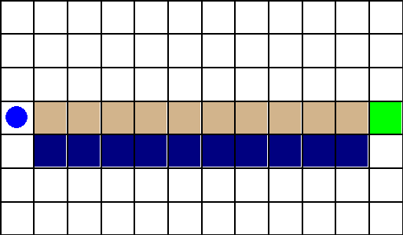
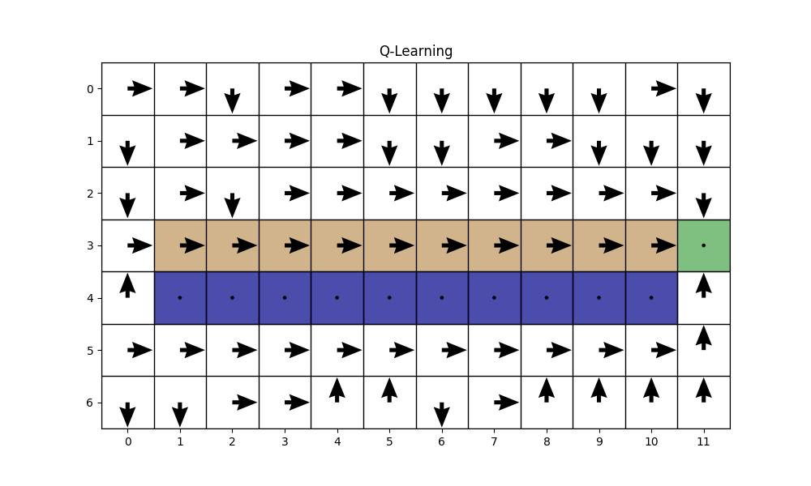
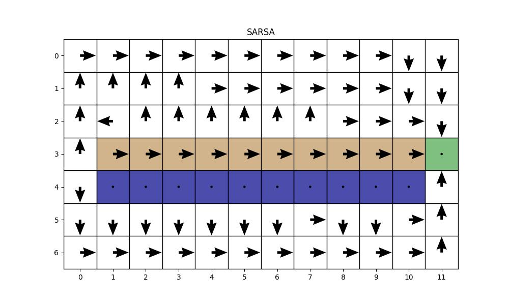
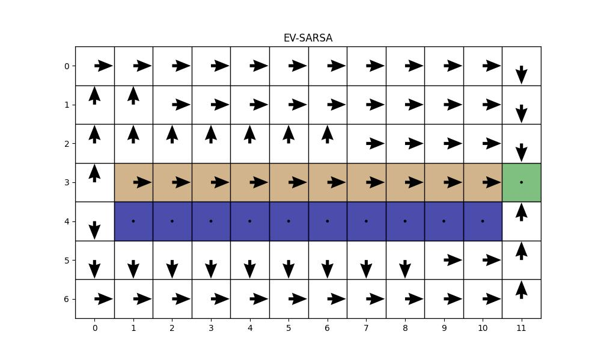

# Introduction to RL. Part 2. Value based methods.

Welcome to the second lesson! I hope you enjoyed the first lesson and had a chance to play with the hyperparameters of ES and CEM to see how they really work! In this lesson, we will look at RL from a mathematical perspective. We'll define some new terms that help us solve different problems using Reinforcement Learning. Shall we start?

## Table of Contents

1. [Markov Decision Process](#markov-decision-process)
   - [Markov Property](#markov-property)
   - [Simple Environment Example & Policy Types](#simple-environment-example--policy-types)

2. [State Values and State-Action Values](#state-values-and-state-action-values)
   - [State Values](#state-values)
   - [State-Action Value](#state-action-value)
   - [Bellman Equations](#bellman-equations)
   - [A Quick Example](#a-quick-example)
   - [How to Derive Q from V and V from Q](#how-to-derive-q-from-v-and-v-from-q)
   - [Example](#example)
   - [Optimal Value Functions](#optimal-value-functions)
   - [The Bellman Optimality Equations](#the-bellman-optimality-equations)
   - [Value Iteration](#value-iteration)
   - [Problems of Value Iteration](#problems-of-value-iteration)

3. [Model-Free Learning and TD](#model-free-learning-and-td)
   - [Model-Free Learning](#model-free-learning)
   - [Model-Free Prediction: The Monte Carlo Method](#model-free-prediction-the-monte-carlo-method)
   - [Temporal Difference (TD) Learning](#temporal-difference-td-learning)
   - [The Exploration vs. Exploitation Dilemma](#the-exploration-vs-exploitation-dilemma)
   - [SARSA](#sarsa)
   - [Variants of SARSA](#variants-of-sarsa)
   - [Comparing Q-Learning vs SARSA vs EV-SARSA](#comparing-q-learning-vs-sarsa-vs-ev-sarsa)
   - [N-step TD Learning, TD(λ) and Eligibility Traces](#n-step-learning)
   - [SARSA(λ)](#sarsalambda)

4. [Conclusion](#conclusion)

# Markov Decision Process

First, let's define the playground for many Reinforcement Learning algorithms. RL cannot solve just any problem — it’s designed for a specific set of problems. These problems share a key feature: they can be modeled as Markov Decision Processes (MDPs). The name comes from a crucial assumption they satisfy: the Markov Property.

## Markov Property

The Markov Property is a fundamental assumption for RL. It can be summarized in one sentence: **the future is independent of the past, given the present**.

In other words, the probability of transitioning to the next state $s_{t+1}$ and receiving reward $r_{t+1}$ depends only on the current state $s_t$ and the action taken $a_t$, not on the entire history of states and actions before that.

$$
P(s_{t+1}, r_{t+1} | s_t, a_t) = P(s_{t+1}, r_{t+1} | s_t, a_t, s_{t-1}, a_{t-1}, ..., s_0, a_0)
$$

Simply put: all the useful information from the history that we need to predict the immediate future is captured within the current state $s_t$. Knowing $s_t$ and the action $a_t$ makes the older history unnecessary for predicting what happens next. Problems that satisfy this property are called Markovian, and they form the basis for Reinforcement Learning.

So, the second simple interpretation claims that state representation must contain enough information for the agent to choose the best action. Both interpretations are valid; however, some confusion might arise. The formal definition refers to $P(s_{t+1}, r_{t+1} | s_t, a_t)$ which is a probability of transitioning to some specific next state $s_{t+1}$ and obtaining some specific reward $r_{t+1}$. Well then how does it transfer to state representation?

The connection is direct and crucial.

Think about the agent's goal: it wants to choose the best possible action. To be "best," an action must be the one that leads to the highest expected future reward. To figure that out, the agent must be able to, in some sense, predict the consequences of its actions, i.e. what would be the next state and the reward for that action.

The Markov property is the guarantee that allows this to happen. It tells us that the only piece of information needed to predict the future is the current state, $s_t$. The entire past history adds no new predictive power.

Therefore, if $s_t$ is all the information the environment needs to determine what happens next, then $s_t$ must also be all the information the agent needs to make an optimal decision about what to do next.

Think about it: how can you decide what is the best option when you don’t have all the facts? For example, you’re in the store looking at two yogurts and trying to decide which one to buy. Knowing only the brand names isn’t enough for you to make the best choice; you need all the information you can get: price, expiration date, calories, reviews, and so on.

---

Let's look at two examples and try to understand whether they are Markovian or not.

### Chess Game

In chess, the current configuration of all pieces on the board serves as the state $s_t$. Knowing only this state is enough to determine all legal moves and the potential outcomes of those moves according to the rules. How the pieces arrived at their current positions (for example, why a piece was taken earlier) doesn’t change the rules or possibilities moving forward from the current board state. Given the state $s_t$, our policy $\pi_\theta$ can choose an action $a_t$, which then, according to the game rules (the transition dynamics), leads us to a new state $s_{t+1}$. Chess, under this definition, is essentially Markovian.

### A self-driving car:

Now, let's consider a more realistic and complex example: a self-driving car.

Imagine its only sensor is a single camera frame. The frame shows another car directly in front of it. Is this car moving away, moving towards you, or parked? You can't tell from a single image. This observation is not Markov because it doesn't contain enough information (like velocity) to predict the next state. To make the state more Markovian, the agent would need more information, perhaps by stacking the last four frames together to infer motion.

But even this is just an approximation. To be completely honest, creating a truly Markov state for a problem like autonomous driving is practically impossible. Let's assume our state representation is the last 10 frames from two RGB cameras, plus LIDAR and radar data. This gives us a rich picture of the world, but it's still incomplete. The world contains hidden variables that our sensors cannot see:

- What is the intention of the pedestrian standing on the corner? Are they waiting, or are they about to step into the road? For example, if they are waiting, then the best action is to drive forward. If they are about to step into the road, then the best action is to stop.

- What is the condition of the driver in the car ahead? Are they alert, or are they distracted and about to brake erratically? 

- Is there an unseen patch of black ice just around the blind corner?

No matter how many sensors we add, we can never fully observe the true state of the world. These problems are more accurately described as Partially Observable Markov Decision Processes (POMDPs).

So, the formal definition of the Markov property, which is about the environment's dynamics, transforms into a practical requirement for us as designers: we must strive to create a state representation $s_t$ that is "Markov enough." Our goal is to feed our agent a state that is as rich as possible, capturing all the relevant information from the past so that it can make a well-informed, effective, and safe decision, even if the state isn't theoretically perfect.

## Simple Environment Example & Policy Types

To build a deeper understanding, imagine a game with three states: $s_0, s_1, s_2$. 
- You start in $s_0$, and from this state you have two actions: $a_0, a_1$. 
    - Action $a_0$ transitions you to $s_1$ with reward $R_1$. From state $s_1$ you have only one option: go back to $s_0$ with reward $0$. 
    - Action $a_1$ transitions you to $s_2$ with reward $R_2$. 
- From $s_2$ you also have only one option: terminate the game [let's assume reward on this transition is 0, the $R_2$ was received upon entering $s_2$]. Assume $R_2 > R_1 / (1 - \gamma^2)$ [don't worry about gamma, it is just a condition that makes the second action $a_1$ strictly better].

What's the optimal policy here?

Our human intuition might spot the loop $s_0 \xrightarrow{a_0, R_1} s_1 \xrightarrow{a_0, 0} s_0$. We think, "Maybe I can collect many $R_1$ rewards by looping, and then, when I'm 'tired', take action $a_1$ from $s_0$ to get $R_2$ and finish."

**But can a standard RL algorithm find this specific strategy?**

Policies in Standard MDPs are (typically) deterministic and Markovian: A standard policy $\pi(a|s)$ bases its decision only on the current state $s$. If the environment itself is Markovian (like the one described), then the optimal policy is also guaranteed to be Markovian. It doesn't need history.

**Our "Human" Strategy Isn't Markovian (for state $s_0$)**: The strategy "loop for a while, then switch" depends on how long we have been looping (history), not just on being in state $s_0$.

**What the RL Algorithm Finds?**

Given state $s_0$, a standard policy $\pi(a|s_0)$ must choose either always $a_0$ or always $a_1$. It compares the total expected discounted value of always looping ($V = R_1 / (1-\gamma^2)$) versus the value of terminating ($V = R_2$). Since we assumed $R_2 > R_1/(1-\gamma^2)$, the optimal Markovian policy is to always choose $a_1$ from state $s_0$. It cannot implement the "loop then switch" plan.

Why? The policy function $\pi(a|s)$ doesn't have access to the history or the total accumulated reward unless that information is part of the state $s$. It makes the best decision based only on the information contained in $s$.

**Can RL Ever "Act Like Us"?**

Yes! But it requires acknowledging that the "loop then switch" strategy implies the simple state $s \in \{s_0, s_1, s_2\}$ isn't sufficient (it's not Markovian for that strategy). To achieve this behavior, we would need to:

- **Enhance the State Representation**: Define the state to include history, for example, $s' = (s, \text{loop\_count})$. Now the policy $\pi(a|s')$ can learn to choose $a_0$ when loop_count is low and $a_1$ when loop_count is high, because the necessary information is in the state.

- **Use stochastic policy**: a policy does not have to be deterministic. A stochastic policy can choose actions with some probability given the current state. For example, in this case, given state $s_0$, the policy can converge to $\pi(a_0|s_0) = 0.9$ and $\pi(a_1|s_0) = 0.1$, meaning that with 90% chance the agent will choose $a_0$. This way it will earn more rewards, until eventually it randomly (with p = 0.1) chooses to go to $s_2$ and terminate the game.

So, with this example, I wanted to emphasize the importance of state representation. A wrong state representation can lead to sub-optimal policies or even failures.

# State values and State-Action values

Okay, I hope you got a clear understanding of Markov Property. Now, let's switch to a more interesting topic, how do we solve MDP environments? But before we can jump to powerful algorithms we have to introduce some new concepts.

## State values

First one is state value or $V(s)$. You can think of this value as a measure of the usefulness of the state. It means that the higher $V(s)$ the higher attractiveness of that state.

Mathematically, we say that state value is the expectation (basically a mean for random variables) of total cumulative reward if we start from state $s$ and then act according to our policy $\pi$.

$$
V(s) = \mathbb{E}[\sum_{t=0}^\infty R_t | S_t = s]
$$

Expectation is here because our trajectories starting from this state can be very different, each with its own probability. We have to find an average of all trajectories to decide how useful that state was as a starting point.

This is often written as:

$$
V^\pi(s) = \mathbb{E}_\pi \left[ \sum_{k=0}^\infty \gamma^k r_{t+k+1} \mid S_t = s \right]
$$

where $\gamma$ is the discount factor ($0 \leq \gamma < 1$), $r_{t+k+1}$ is the reward received $k$ steps into the future, and the expectation is taken over the stochasticity of the environment and the policy $\pi$.

> A quick note, we use the same notation as in the first lesson. So, $r_{t+1}$ is the reward obtained by the agent by doing action $a_t$ in state $s_t$. 

## State-Action Value 

Closely related is the state-action value function, $Q(s, a)$, which represents the expected return starting from state $s$, taking action $a$, and thereafter following policy $\pi$:

$$
Q^\pi(s, a) = \mathbb{E}_\pi \left[ \sum_{k=0}^\infty \gamma^k r_{t+k+1} \mid S_t = s, A_t = a \right]
$$

So, in simple terms: the $Q$-function tells us how good it is to take that particular action in that particular state. Similarly, the $V$-function tells us how good it is to be in that particular state (assuming that after that we act according to policy $\pi$).

We need these two terms to describe numerically what is the best solution to a problem. So, if we knew all true $V(s)$ for all possible states, then we would simply use actions that would lead us to the best states. That would be an extremely easy task. Similarly, by knowing all true $Q(s,a)$ for all possible combinations of state and actions, then we would just pick the action with the highest $Q(s,a)$ from this state; basically, we wouldn't need any policy. The difficulty is how to find these true values, and that is the problem that we will try to solve.

## Bellman Equations

The value functions satisfy important recursive relationships known as the Bellman equations. In other words, the state value represents the expected accumulated reward the agent receives, so naturally it means that $V(s_t)$ depends on $V(s_{t+1})$ (because after state $s$ we have to move to some other state $s'$). But if there is a dependency, then there is recursion, right?

$$
V^\pi(s) = \mathbb{E}_\pi \left[ \sum_{k=0}^\infty \gamma^k r_{t+k+1} \mid S_t = s \right] \\
V^\pi(s) = \mathbb{E}_\pi \left[ \sum_{k=1}^\infty r_{t+1} + \gamma^k r_{t+k+1} \mid S_t = s \right] \\
V^\pi(s) = \mathbb{E}_\pi \left[ r_{t+1} + \gamma V^\pi(s_{t+1}) \mid S_t = s \right]
$$

So, our $V(s_t)$ is a reward that we get when we transition to some next state $s_{t+1}$ plus the $V(s_{t+1})$ discounted by $\gamma$. Since there could be several possible next states and there are various actions that can lead to those states, we should find an expectation over all possible actions and next states.

For a given policy $\pi$, the Bellman equation for the state value function is:

$$
V^\pi(s) = \sum_{a} \left\{ \pi(a|s) \sum_{s', r} P(s', r | s, a) \left[ r + \gamma V^\pi(s') \right] \right\}
$$

This equation expresses the value of a state as the expected immediate reward plus the discounted value of the next state, averaged over all possible actions and transitions according to the policy and environment dynamics.

Similarly, the Bellman equation for the state-action value function is:

$$
Q^\pi(s, a) = \sum_{s', r} P(s', r | s, a) \left[ r + \gamma V^\pi(s') \right]
$$

which is basically the same as for state value function, except that we evaluate it for one specific action.

## A quick example 

The agent is in state $s_0$, it has two actions to choose from $a_1, a_2$. Let's say that if the agent chooses $a_1$, then it flips a coin and based on the result it can either be transited to $s_1$ and getting reward = 10 or $s_2$ and getting reward = -4. Alternatively, taking action $a_2$ always leads to state $s_3$ with reward = 2. And finally, let's say that there is already some defined policy that favours second action $a_2$ giving to it 70% probability. 

So, our $Q(s, a)$ would be (assuming $V(s_1) = V(s_2) = 0$, i.e. both of these states are terminal, there is no more reward after we transit to them ):

$$
Q(s_0, a_1) = 0.5 \cdot (10 + V(s_1)) + 0.5 \cdot (-4 + V(s_2)) = 3  \\
Q(s_0, a_2) = 1 \cdot (2 + V(s_3)) = 2
$$

And finally, our $V(s_0)$ is simply a sum of both Q(s, a) weighted by their probabilities:

$$
V(s_0) = \sum_{a} \pi(a|s_0) Q(s_0, a) = 0.3 \cdot 3 + 0.7 \cdot 2 = 1.7
$$

So, under this defined policy our value for that state is 1.7. 

**Question**: is assumed policy optimal (the best)?

## How to derive $Q$ from $V$ and $V$ from $Q$

The two value functions are tightly connected. In fact, if you know one, you can compute the other — at least in principle.

- **Deriving $Q$ from $V$:**  
  If you know $V^\pi(s)$ for all $s$, you can compute $Q^\pi(s, a)$ using the Bellman equation:
  $$
  Q^\pi(s, a) = \sum_{s', r} P(s', r | s, a) \left[ r + \gamma V^\pi(s') \right]
  $$
  That is, for each possible next state $s'$ and reward $r$, you sum over the probability of transitioning to $s'$ and receiving $r$, and add the discounted value of $s'$.

- **Deriving $V$ from $Q$:**  
  If you know $Q^\pi(s, a)$ for all $(s, a)$, you can compute $V^\pi(s)$ by averaging over the policy:
  $$
  V^\pi(s) = \sum_a \pi(a|s) Q^\pi(s, a)
  $$
  That is, you take the expected $Q$ value under the current policy's action probabilities.

Why "at least in principle"? Because to derive $Q$ from $V$ you need to know the model of the environment - $P(s', r | s, a)$. The transition probabilities are not really available to us, the environment is a black box - all we do is provide actions to it, the transitions are calculated inside and returned to us.

## Example

Okay, time to see some practical example to solidify these formulas. The idea is quite simple, we just defined two new concepts one is saying how good it is to be in state $s$ and the second one is saying how good it is to take action $a$ from state $s$. All these expectations are a way to work with not deterministic problems, but with stochastic. 

Let's consider a simple stochastic environment with two states: $S_1$ and $S_2$.

### Environment Description

- **States:** $S_1$, $S_2$
- **Actions:** $a_1, a_2$ (available in both states)
- **Transitions and Rewards:**
  - From $S_1$, taking action $a_1$:
    - With probability $0.7$, move to $S_1$ and get reward $-7$
    - With probability $0.3$, move to $S_2$ and get reward $20$
  - From $S_1$, taking action $a_2$:
    - With probability $1.0$, move to $S_2$ and get reward $1$
  - From $S_2$, both actions:
    - With probability $1.0$, stay in $S_2$ and get reward $0$. Basically saying that $S_2$ is the terminal state.
- **Discount factor:** $\gamma = 0.9$
- **Policy:** Let's consider two policies:
  - $\pi_1$: Always take $a_1$ in $S_1$
  - $\pi_2$: Always take $a_2$ in $S_1$

### Step 1: Write the Bellman Equations

Let $V^{\pi}(S_1)$ and $V^{\pi}(S_2)$ be the value functions for each state under policy $\pi$.

#### For $S_2$ (any policy):
- Only one possible transition:

  $
  V^{\pi}(S_2) = \mathbb{E}[r + \gamma V^{\pi}(S_2)] = 0 + 0.9 \cdot V^{\pi}(S_2)
  $

  $
  V^{\pi}(S_2) = 0.9 \cdot V^{\pi}(S_2)
  $

  $
  V^{\pi}(S_2) = 0
  $

#### For $S_1$:

##### Policy $\pi_1$ (always $a_1$):
- Two possible transitions:

  $
  V^{\pi_1}(S_1) = 0.7 \cdot [-7 + 0.9 V^{\pi_1}(S_1)] + 0.3 \cdot [20 + 0.9 V^{\pi_1}(S_2)] + 0 \cdot 1 \cdot [1 + 0.9 V^{\pi_1}(S_2)]
  $

  Substitute $V^{\pi_1}(S_2) = 0$:

  $
  V^{\pi_1}(S_1) = 0.7 \cdot (-7 + 0.9 V^{\pi_1}(S_1)) + 0.3 \cdot (20 + 0)
  $

  $
  V^{\pi_1}(S_1) = 0.7 \cdot -7 + 0.7 \cdot 0.9 V^{\pi_1}(S_1) + 0.3 \cdot 20
  $

  $
  V^{\pi_1}(S_1) = -4.9 + 0.63 V^{\pi_1}(S_1) + 6
  $

  $
  V^{\pi_1}(S_1) = 1.1 + 0.63 V^{\pi_1}(S_1)
  $

  $
  V^{\pi_1}(S_1) - 0.63 V^{\pi_1}(S_1) = 1.1
  $

  $
  0.37 V^{\pi_1}(S_1) = 1.1
  $

  $
  V^{\pi_1}(S_1) = \frac{1.1}{0.37} \approx 2.97
  $

##### Policy $\pi_2$ (always $a_2$):
- Only one possible transition:

  $
  V^{\pi_2}(S_1) = 0 \cdot (0.7 \cdot [-7 + 0.9 V^{\pi_2}(S_1)] + 0.3 \cdot [20 + 0.9 V^{\pi_2}(S_2)]) +  1s \cdot [1 + 0.9 V^{\pi_2}(S_2)]
  $

  Substitute $V^{\pi_2}(S_2) = 0$:

  $
  V^{\pi_2}(S_1) = 1 + 0.9 \cdot 0 = 1
  $

### Step 2: Compute $Q$-values

Let's compute $Q(S_1, a_1)$ and $Q(S_1, a_2)$ using the Bellman equation for both policies:

$
Q^{\pi}(S_1, a_1) = \pi^{x}(a_1 | s_1) \cdot (0.7 \cdot [-7 + 0.9 V^{\pi}(S_1)] + 0.3 \cdot [20 + 0.9 V^{\pi}(S_2)])
$

$
Q^{\pi}(S_1, a_2) = \pi^{x}(a_2 | s_1) \cdot [1 + 0.9 V^{\pi}(S_2)]
$

Using $V(S_2) = 0$ for both policies:

- For $a_1$:

  $
  Q^{\pi_1}(S_1, a_1) = 0.7 \cdot [-7 + 0.9 \times 2.97] + 0.3 \cdot 20 \approx 10.4 \\ 
  Q^{\pi_2}(S_1, a_1) = 0 \cdot (1 \cdot [1 + 0.9 \times 0]) = 0
  $

- For $a_2$:

  $
  Q^{\pi_1}(S_1, a_2) = 0 \cdot [1 + 0.9 \times 0] = 0 \\
  Q^{\pi_2}(S_1, a_2) = 1 \cdot [1 + 0.9 \times 0] = 1
  $

## Optimal Value Functions

Okay, once we've understood what $V(s)$ and $Q(s, a)$ are, we can explore their most important forms: their **optimal values**. To remind you, the ultimate goal in reinforcement learning is to find an optimal policy, $\pi^*$, that achieves the highest possible total reward.

The optimal value functions tell us what the expected return would be if we were to follow this perfect, optimal policy.

**Optimal state-value function:**  
$$
V^*(s) = \max_{\pi} V^{\pi}(s)
$$

**Optimal state-action value function:**  
$$
Q^*(s, a) = \max_{\pi} Q^{\pi}(s, a)
$$

### Unpacking "Max Over All Policies"

What does the $\max_{\pi}$ operator really mean? It means we are searching through the entire universe of possible policies - every conceivable strategy for mapping states to actions - and finding the single best one.

Think of it like this: imagine you could try out every possible strategy for playing a game of chess. Some strategies are terrible, some are okay, and one is the perfect, unbeatable strategy. The optimal value function, $V^*(s)$, tells you the outcome you would get from a particular board state $s$ if you played using that single, perfect strategy.

Basically, the optimal value for a state, $V^*(s)$, is the value generated by the optimal policy, $\pi^*$.

## The Bellman Optimality Equations

If we have the optimal value functions, they must satisfy a special self-consistency condition known as the **Bellman optimality equations**. These look similar to the regular Bellman equations but have a crucial max operator.

The Bellman optimality equation for $V^*(s)$ is:

$$
V^*(s) = \max_{a} \sum_{s', r} P(s', r \mid s, a) [r + \gamma V^*(s')]
$$

This can be more intuitively written by relating it to the optimal Q-function:

$$
V^*(s) = \max_{a} Q^*(s, a)
$$

**Clear Explanation:**  
This equation says something very intuitive: The value of being in a state $s$ under the best possible policy is simply the value of taking the single best action $a$ from that state. To find $V^*(s)$, you would look at the Q-values for all possible actions from state $s$ and pick the action with the highest Q-value. 

The Bellman optimality equation for $Q^*(s, a)$ is:

$$
Q^*(s, a) = \sum_{s', r} P(s', r \mid s, a) \left[ r + \gamma \max_{a'} Q^*(s', a') \right]
$$

**Clear Explanation:**  
This equation is the heart of TD learning that we explore next. It says: The value of taking a specific action $a$ in state $s$ is the immediate reward $r$ you get, **plus** the discounted value of the future state.

But what is the future state value? It's the value you get by assuming that once you land in the next state $s'$, you will continue to act optimally from that point forward. That's what the $\max_{a'} Q^*(s', a')$ term means: from your new state $s'$, look ahead at all possible next actions $a'$ and pick the one with the highest Q-value. This recursive nature—defining the optimal value in terms of the optimal value of the next state—is what allows algorithms like Q-learning to iteratively find the solution.

So, in our quick example above, the defined policy was not the optimal, the optimal policy would be the one that chooses action based on the highest Q-value. 

> The optimal policy means that the agent picks the action with a highest corresponding Q-value. That makes this policy deterministic: the agent always performs the same action from the same state. 

## Value Iteration

The Bellman optimality equation is great because it gives us a target, but how do we actually find the values for $V^*(s)$ when we don't know them to begin with?

We use an algorithm called **Value Iteration** (VI). The core idea is incredibly simple: we start with a complete guess, and then we repeatedly apply the Bellman update rule to our guess until it stops changing. When our values stop changing, they have "converged," and we have found the optimal values.

This process works because the Bellman update is a special kind of function called a **contraction mapping**. This is a fancy term for a simple idea: every time you apply the function, it brings your estimate closer to the true answer.

---

### An Analogy: Finding a Fixed Point

To build intuition, let's look at a simple math problem: find the number $x$ where $\cos(x) = x$. How would you solve this without advanced math? You could use **fixed-point iteration**!

Start with a random guess: Let's say $x_0 = 0.5$.

Repeatedly apply the function:

- $x_1 = \cos(x_0) = \cos(0.5) = 0.877$
- $x_2 = \cos(x_1) = \cos(0.877) = 0.639$
- $x_3 = \cos(x_2) = \cos(0.639) = 0.802$
- $x_4 = \cos(x_3) = \cos(0.802) = 0.695$
- ...and so on...

If you keep doing this, you'll notice the value zig-zags but eventually converges to $x \approx 0.739...$, which is the "fixed point" where the output of $\cos(x)$ is equal to its input $x$. The function $\cos(x)$ acts as a contraction, pulling any starting point towards this single solution.

---

### Connecting it Back to Value Iteration

Value Iteration works on the exact same principle.

- Our "variable" is our entire table of value function estimates, $V_k(s)$. We start with $V_0(s)$ initialized to all zeros.
- Our "function" is the Bellman Optimality update.
- We repeatedly apply the function: We calculate the next set of values, $V_{k+1}(s)$, using our current estimates, $V_k(s)$.

$$
V_{k+1}(s) = \max_a \sum_{s', r} P(s', r \mid s, a)[r + \gamma V_k(s')]
$$

The crucial mathematical guarantee is that, **because our discount factor $\gamma$ is less than 1**, this Bellman update is a contraction mapping. Every time we apply this update, our current estimate $V_k$ gets provably closer to the true optimal value function $V^*$.

We simply repeat this process until the changes become negligible (i.e., $V_{k+1} \approx V_k$). At that point, we have found the fixed point, which is the optimal value function $V^*$. 

### Problems of Value Iteration

Value Iteration can be surprisingly effective despite its simplicity. But, it is not used on modern RL problems, can you guess why?

Well, there are two major problems:

- Value Iteration assumes a perfect model of the MDP is available (knowing all transition probabilities $P(s', r | s, a)$ and rewards $r$). Without this model, it cannot work. But in the vast majority of RL problems, the model is not available to us. It is a black box, as we discussed already.
- Even if the model is available (or learned), VI works for problems with finite and small state space. Think about it, iterating over a massive amount of states would take a long time. Remember we calculated the number of possible states in a simple grayscale 640x640 game? It was 256^(640*640), good luck iterating over all of them :)

# Model-Free Learning and TD 

## Model-Free learning

First of all, let's recall what we learned so far. We learned a simple, yet powerful algorithm called Value Iteration. This algorithm is based on the Bellman Optimality Equations, which define the optimal state-value function $V^*(s)$ and optimal action-value function $Q^*(s,a)$. We also learnt to what specific problems we can apply it - problems with known model and small state-space. In this section we will try to solve the first problem - lack of model.

So how do we learn optimal behavior without explicitly knowing the environment's dynamics? **This is where model-free methods come in.**

### The Problem: What if We Don't Know the Model?

Lack of known model leads us to a fundamental fork in the road for RL, defining two major families of algorithms:

- **Model-Based RL:** Try to learn an approximation of the model $P(s', r \mid s, a)$ from experience. You would use your collected data to build a statistical model of the environment's dynamics. Once you have a good enough model, you can use it to perform Value Iteration or other planning algorithms inside your learned model.

- **Model-Free RL:** Ignore the model entirely. Instead of trying to learn the environment's rules, we find a way to estimate the value functions $V(s)$ or $Q(s,a)$ directly from the experience $(s, a, r, s')$ we collect bypassing the need to compute probabilities.

Most of the famous successes in deep reinforcement learning have come from model-free approaches because learning an accurate model of a complex environment can be extremely difficult. Let's explore the simplest and most intuitive model-free method first.

## Model-Free Prediction: The Monte Carlo Method

How can we estimate the value of a state, $V(s)$, without knowing the environment's dynamics? The Monte Carlo (MC) approach provides a brilliant and simple answer.

Remember the original definition of the state-value function: 

$$
V(s) = \mathbb{E}[\sum_{t=0}^\infty R_t | S_t = s]
$$

it's the expected total return (cumulative reward) you get starting from that state and acting according to the policy. And the optimal state values are the one that maximize the total return. So, what if instead of trying to compute it via Bellman equations we just... measured it? And can we do it? Of course we can! 

The big idea of Monte Carlo method is to estimate the expected value by simply averaging the returns we've actually observed.

### Core Idea

MC methods learn from complete episodes. An agent follows a policy $\pi$ to generate a full trajectory $<s_0, a_0, r_1, s_1, ..., s_{T-1}, a_{T-1}, r_T>$. Only once the episode is finished (at terminal step $T$), can learning occur for that episode.

To estimate $V_\pi(s)$, MC methods calculate the actual total discounted return $G_t = \sum_{k=0}^{T-t-1} \gamma^k r_{t+k+1}$ starting from each time step $t$ where state $s$ was visited. The value $V_\pi(s)$ is then estimated simply by averaging these observed returns $G_t$ over many episodes. Similarly, $Q_\pi(s,a)$ can be estimated by averaging returns following visits to the specific state-action pair $(s,a)$.

A question may arise: how do you deal with cases when a state was visited several times during one episode? The simple and effective answer is to choose one of two approaches: either average the returns from every visit to the state within that episode, or (more commonly) only use the return from the first time the state was visited in the episode and ignore later visits.

MC updates use only actual, complete returns, $G_t$, from experience. They don't use estimates of other states' values to update the current state's value. This makes the method unbiased, but it has high variance. High variance is a result of noise in the individual trajectories: each episode might take a different path due to stochasticity in the environment or policy, leading to very different returns even from the same starting state.

This reliance on complete episodes explains why MC methods might feel different from a simple notion of "play and learn based on your reward immediately". Updates only happen retrospectively after the final outcome is known. In other words, we are not learning while we are playing; we only learn once we have finished. 

---

### Estimating V(s) vs. Q(s,a) in Model-Free Learning

A quick side-note on what we actually want to compute. As we already know, we have two main values that we estimate: $V(s)$ and $Q(s,a)$. What is more valuable to compute?

While learning $V^*(s)$ (the optimal state value) might seem sufficient, consider how an agent chooses an action. If it only knows $V^*(s)$, to decide the best action $a$ from state $s$, it still needs a model to look ahead one step:

$$
\pi^*(s) = \arg\max_a \sum_{s', r} P(s', r | s, a) \left( r + \gamma V^*(s') \right)
$$

Our intuition is if we are in the state $s$ we need to transit to the next best state $s'$, but without knowing the transition probability we cannot identify what action would lead us there. So, without the model $P$, knowing $V^*(s)$ alone isn't enough to determine the best action.

However, if we directly estimate the optimal action-value function $Q^*(s,a)$, selecting the best action becomes simple and model-free:

$$
\pi^*(s) = \arg\max_a Q^*(s, a)
$$

The agent just needs to compare the learned Q-values for all actions possible in the current state $s$ and pick the best one. Therefore, for model-free control (finding the optimal policy), learning $Q$-values is generally much more direct and useful than learning $V$-values. 

---

### Pseudocode: Monte Carlo Prediction (First-Visit MC)

1. Initialize:
    - For all states $s$ and actions $a$, set $Q(s, a) = 0$
2. For each episode:

    - 2.1. Generate an episode following policy $\pi$: $S_0, A_0, R_1, S_1, ..., S_{T-1}, A_{T-1}, R_T$
    - 2.2. For each state-action pair ($s$, $a$) appearing in the episode:
        - i. Let $t$ be the first time step that state-action pair ($s$, $a$) is visited in the episode
        - ii. Compute the return $G_t = \sum_{k=0}^{T-t-1} \gamma^k R_{t+k+1}$
        - iii. Update $Q(s,a) \leftarrow Q(s,a) + \alpha (G_t - Q(s,a))$ (moving average)
3. Repeat for many episodes

This algorithm estimates the value of each state as the average return observed after visiting that state, using complete episodes generated by following the policy.

## Temporal difference (TD) learning 

So, Monte Carlo methods require waiting until the end of an episode to update value estimates. The obvious question is: can we learn during the episode, essentially learning as we play? The answer is yes, using Temporal Difference (TD) learning.

The core idea is to use the Bellman equation structure, but instead of needing the full model, we update our estimates based on other estimates – a process called bootstrapping. This might sound similar to Value Iteration, where we updated $V_k$ using $V_{k-1}$. However, Value Iteration required the environment model to compute the expected values across all possible next states and rewards.

In model-free TD settings, we don't have the model. Instead, we learn directly from the experience tuples $<s, a, r, s'>$ as we generate them. After taking action $a$ in state $s$ and observing the immediate reward $r$ and the next state $s'$, we can immediately use this information to improve our estimate for the value of state $s$ (or state-action pair $(s,a)$). We learn one step at a time, using the observed transition rather than a known probability distribution.

### Bellman Optimality Equation for Q-values:

The optimal Q-function must satisfy its own Bellman Optimality Equation:

$$
Q^*(s,a) = \sum_{s', r} P(s', r | s, a) \left( r + \gamma \max_{a'} Q^*(s', a') \right)
$$

> Note: This relates $Q^*(s,a)$ to the maximum Q-value possible from the next state $s'$, because $V^*(s') = \max_{a'} Q^*(s', a')$.

Again, transition probabilities $\sum_{s', r} P(s', r | s, a)$ are unknown to us. Nothing we can do about it. But the whole idea of MC and TD learning is to try to compute the optimal values without these probabilities.

The unknown part is basically a weighted average of all possible next state-action values. The weights are the probabilities of transitioning to a possible next state.
Since in our tuple there is only one next state, we bypass this averaging and work only with one next state. It is important to understand that this is not the optimal $Q*$, it is just our estimate based on one sample. It is inaccurate and the main idea is that with more samples we would better understand the transition probabilities and thus improve our estimates of Q-values.

$$
\text{TD Target} = ( r + \gamma \max_{a'} Q^*(s', a'))
$$

The TD Target is a noisy, sample-based estimate of what the true expected value $Q^*(s,a)$ should be. Because the environment can be stochastic (different rewards or next states could occur even from the same state under the same action) and our current Q estimates might be wrong, the TD Target calculated from one step will fluctuate.

So, for stability of learning we need a technique to smooth out this noise, one of the simplest and widely used technique is moving average:

$$
Q(s,a) \leftarrow (1-\alpha)Q(s,a) + \alpha[\text{TD Target}] \\
Q(s,a) \leftarrow Q(s,a) + \alpha [\text{TD Target} - Q(s,a)]
$$

The term **$\text{TD Target} - Q(s,a)$** is called Temporal Difference (TD). This is basically the difference between the updated estimate and our current estimate.

This iterative averaging process allows the estimate $Q(s,a)$ to converge towards the true expected value $Q^*(s,a)$ despite the noise in individual TD targets, under appropriate conditions for the learning rate $\alpha$. This algorithm is called Q-learning (well because we learn Q-values) and that is probably one of the most famous Reinforcement Learning algorithm.

## The Exploration vs. Exploitation Dilemma

Now, we know how to update our $Q(s,a)$ estimate once we have an experience tuple $<s, a, r, s'>$. But how should the agent choose the action $a$ in state $s$ to generate that experience in the first place?

This leads to a fundamental dilemma in reinforcement learning: **Exploration vs. Exploitation.**

- **Exploitation**: Acting based on the current knowledge to maximize immediate expected reward. This means choosing the action $a$ that currently has the highest estimated Q-value: $a = \arg\max_{a'} Q(s, a')$. This is often called acting greedily. And it totally makes sense, if we know that taking a certain action $a$ is the best option we have, we don't we choose it? This is the essence of exploitation.

- **Exploration**: Trying out actions that don't currently look like the best option. This might involve choosing an action $a \neq \arg\max_{a'} Q(s, a')$. This is necessary to discover potentially better actions whose values might initially be underestimated, or simply to get more accurate estimates for all actions.

- **The Dilemma:** If the agent only exploits, it might get stuck in a suboptimal routine because it never tries actions that could potentially lead to much higher long-term rewards. If the agent only explores (e.g., acts randomly), it performs poorly because it never leverages the knowledge it has gained. Finding a good balance is critical for effective learning.

#### Why Exploration is Crucial for Q-Learning:

Q-learning aims to find the optimal Q-values, $Q^*(s,a)$. Its update rule uses the $\max_{a'} Q(s', a')$ term, which inherently learns about the value of acting greedily in the future. However, to ensure that the Q-values themselves converge correctly for all relevant state-action pairs, the agent needs to actually visit those pairs.

If the agent acts purely greedily from the start based on potentially poor initial Q-value estimates, it might never execute certain actions in certain states. Consequently, the Q-values for those untried actions would never be updated via the Q-learning rule, and the agent might never realize they were actually better.

Exploration, especially early in training when Q-value estimates are inaccurate, is essential to gather information across all possible actions and ensure that the estimates can eventually converge to their true optimal values.

#### The Epsilon-Greedy Policy

A simple and widely used strategy to balance exploration and exploitation during learning is the **$\epsilon$-greedy policy**. The following logic is applied:

- Choose a small value for $\epsilon$ (epsilon), typically between 0 and 1 (e.g., 0.1).
- With probability $1 - \epsilon$: Exploit by choosing the action with the highest current Q-value: $a = \arg\max_{a'} Q(s, a')$.
- With probability $\epsilon$: Explore by choosing an action uniformly at random from all possible actions available in state $s$.

So, the role of $\epsilon$ becomes clear:

- If **$\epsilon = 0$:** the policy is purely greedy (pure exploitation).

- **If $\epsilon = 1$:** the policy is purely random (pure exploration).

**Common Practice:** Often, $\epsilon$ is started at a higher value (e.g., 0.9) early in training to encourage broad exploration and then gradually decreased (annealed) over time towards a small value (e.g., 0.1 or 0.01). This shifts the balance from exploration towards exploitation as the agent gains more experience and its Q-value estimates become more reliable.

Using an $\epsilon$-greedy policy (or other exploration strategies) to generate the $<s, a, r, s'>$ tuples allows Q-learning to effectively learn the optimal $Q^*$ values even though its update rule focuses on the greedy path via the max operator.

And that is the complete algorithm; again, the pseudo-code:

1. Start with all our estimates being zero: $\forall s \in S, a \in A; \space Q(s,a) = 0$
2. Get initial $s$ from environment
3. Repeat:
    1. Choose $a$ from $s$ using an $\epsilon$-greedy policy
    2. Act in the environment and get reward $r$ and new state $s'$
    3. Update Q-value for this state-action pair 
        1. Calculate the TD target: $ y = r + \gamma \max_{a'} Q(s', a') $. If the next state is terminal, then the target is simply: $ y = r $
        2. Update the current Q-value estimate using moving average: $Q(s,a) \leftarrow Q(s,a) + \alpha (y - Q(s,a))$
    4. Set $s$ to $s'$ 

## SARSA

SARSA is also another well-known TD algorithm. It works very similar to Q-learning with just one small difference. In Q-learning our $\text{TD Target}$ was estimated as reward + maximum Q-value of the next state. Taking maximum can be tricky, although the highest Q-value means the better action, but as we just guess (estimate) Q-values, we sometimes can be wrong in our estimations.

So why can taking the maximum be bad?

1. **Overestimation Bias**

The main issue is that the $\max$ operator tends to overestimate the true value when the Q-values are only estimates (and thus noisy). If the Q-values for the next state $s'$ are not accurate (which is common during learning), the maximum is likely to select not just the best action, but also the action whose Q-value has been overestimated due to random noise or limited experience. Over time, this can cause the learned Q-values to systematically overestimate the true values.

2. **Propagation of Errors**

Imagine that the max operator chose the bogus best action in the next state (its Q values was high because of noise and our inaccuracy in estimation), we use its Q-value to improve our estimate of the current state. So, now our estimate for this state is even worse than it was before, and now this wrong estimation will affect other estimations. Basically, because Q-learning always updates towards the maximum, any overestimated Q-value can propagate through the value function, making the problem worse as learning progresses.

To decrease effects of these problems, SARSA, in contrast, uses the Q-value of the actual action taken in the next state (following the current policy, often $\epsilon$-greedy), not the maximum. Its TD target is:

$$ \text{TD Target}_{\text{SARSA}} = r + \gamma Q(s', a') $$

where $a'$ is the action actually chosen in $s'$. This makes SARSA more conservative and less prone to overestimation, especially in noisy environments. So, SARSA stands for the tuple that we gather: $<s, a, r, s', a'>$

So, the pseudo-code is extremely similar to Q-learning with just one modification:

1. Start with all our estimates being zero: $\forall s \in S, a \in A; \space Q(s,a) = 0$
2. Get initial $s$ from environment
2. Repeat:
    1. If it's a first iteration of an episode: Choose $a$ from $s$ using an $\epsilon$-greedy policy. Else use $a = a'$
    2. Act in the environment and get reward $r$ and new state $s'$
    3. Choose $a'$ from $s'$ using same policy
    3. Update Q-value for this state-action pair 
        1. Calculate the TD target: $ y = r + \gamma Q(s', a') $. If the next state is terminal, then the target is simply: $ y = r $
        2. Update the current Q-value estimate using moving average: $Q(s,a) \leftarrow Q(s,a) + \alpha (y - Q(s,a))$
    4. Set $s$ to $s'$

## Variants of SARSA

There are various variants of SARSA, one of them is **Expected Value SARSA (EV-SARSA)**. To understand why it was created, we first need to place Q-Learning and SARSA on a spectrum of "on-policy-ness."

### The On-Policy Spectrum: Q-Learning vs. SARSA

- **Q-Learning (Off-Policy):** In Q-learning, the update rule uses the max operator:  
  $$
  y = r + \gamma \cdot \max_{a'} Q(s', a')
  $$
  This max operator is fundamentally optimistic and off-policy. It assumes that from the next state $s'$, the agent will take the absolute best action possible, regardless of what its current exploration strategy ($\epsilon$-greedy) might actually make it do. It learns about a hypothetical optimal policy while behaving according to a different, exploratory one.

- **SARSA (On-Policy):** SARSA, on the other hand, tries to be more realistic and on-policy. Its update rule uses the Q-value of the action $a'$ that the current policy actually chose for the next step, thus SARSA learns the value of the policy it is currently following.:  
  $$
  y = r + \gamma \cdot Q(s', a')
  $$
  This makes the learning target directly dependent on the agent's real behavior, including its random exploration steps. If the agent gets unlucky and chooses a random, bad action for $a'$, the learning target will be low. 

---

### EV-SARSA: Even More On-Policy

**EV-SARSA** takes this a step further. It recognizes that SARSA's update, while on-policy, is still based on a single, potentially noisy sample ($a'$). If $a'$ was a random exploration move, it gives a poor representation of the true value of being in state $s'$.

EV-SARSA aims to compute the true expected value of the next state under the current policy. As you remember, the state-value $V(s)$ is the weighted sum of all possible Q-values, where the weights are the probabilities of taking each action.

The expected value is derived using the formula we already know:
$$
V_\pi(s') = \sum_{a'} \pi(a'|s') Q(s', a')
$$

So, the EV-SARSA update rule replaces the single-sample $Q(s', a')$ with this more robust expected value:
$$
Q(s,a) \leftarrow Q(s,a) + \alpha \left[ r + \gamma \sum_{a'} \pi(a'|s') Q(s', a') - Q(s,a) \right]
$$

How do we compute probabilities of next actions in the next state? It actually depends on our exploration strategy. Let's review the case with epsilon-greedy:

First, let's compute the probability of choosing an action which is not the optimal (greedy) one, for that to happen two independent conditions must happen:

- Epsilon strategy let's us pick a random action instead of the greedy one; probability of it $ p = \epsilon $
- We sampling a random action among N-possible actions (each action has an equal probability of picking); probability of it $ p = \frac{1}{N} $

Independent conditions mean that the resulting probability is the product of them:

$$
p(a \neq \arg\max_a Q(s, a)) = \epsilon \cdot \frac{1}{N}
$$

where N is the total number of actions. 

Similarly, to choose optimal action there are two mutual exclusive ways:
- The greedy action is picked because of $\epsilon$ strategy; probability of it $ p = 1 - \epsilon$ 
- During exploration:
    - Epsilon strategy let's us pick a random action instead of the greedy one; probability of it $ p = \epsilon $
    - We sampling a random action among N-possible actions (each action has an equal probability of picking); probability of it $ p = \frac{1}{N} $

Mutual exclusion means that the total probability is the sum of these two ways:

$$
p(a = \arg\max_a Q(s, a)) = 1 - \epsilon + \epsilon \cdot \frac{1}{N}
$$

These probabilities are valid if the total probability of picking all actions sum to one.

$$
p(A) = 1 - \epsilon + \frac{\epsilon}{N} + \frac{\epsilon \cdot (N-1)}{N} = 1
$$

---

### Why This Matters and When EV-SARSA can be Better

**Why is being on-policy important?**  
Being on-policy provides stability. The updates are grounded in the reality of what the agent is actually doing. This is crucial in situations where you need to evaluate the safety or performance of the current policy, not just a hypothetical optimal one.

**When can EV-SARSA perform better than SARSA?**

The key difference is **variance**.

- **SARSA's Weakness:** The SARSA update target can be very noisy. Imagine your $\epsilon$-greedy policy has a 5% chance of taking a random exploratory action. If, by bad luck, it samples a terrible action $a'$ that leads off a cliff, the $Q(s', a')$ value will be very low. This single unlucky sample will drastically pull down your estimate for $Q(s, a)$, even if all other actions from $s'$ were good. SARSA's learning is susceptible to the "bad luck" of its single-sample exploration.

- **EV-SARSA's Strength:** EV-SARSA removes this bad luck. Instead of relying on one potentially noisy sample, it calculates the smooth average over all possible next actions. The impact of that one terrible exploratory action is weighted by its low probability (e.g., $\epsilon / \text{num\_actions}$), so it has a much smaller and more appropriate effect on the update.

## Comparing Q-Learning vs SARSA vs EV-SARSA

A good way to compare these algorithms is to set them free in a carefully designed environment and see how they behave. I've created a simple grid world to serve as an arena for this comparison.

The agent's goal is to get from the starting position (the blue circle) to the goal cell (green). A bridge (tan cells) offers a direct and short path. However, this path is risky: if the agent is on the bridge and takes any action other than moving forward (to the right), there is a 90% chance the "wind" will push it into the chasm (dark blue cells), resulting in a large negative reward and ending the episode.

This simple environment is solvable by all three algorithms, but as we'll see, their final converged policies are quite different.

What is your intuition? How would each algorithm behave?

To find out, I trained each agent and then plotted its final, greedy policy. A quick note on the training: I used a high exploration rate (epsilon) in the beginning, which was decayed slowly. This ensures that the agents definitely experienced falling into the chasm and are aware of the danger of the bridge path.

### Q-Learning: The Optimist

    

Q-Learning's behavior is exactly what we'd expect from a purely rational optimist. Its update rule uses the max operator, which assumes that from the next state, the best possible action will be taken. It learns the value of the truly optimal path, completely ignoring the risks of its own exploration policy.

As a result, it correctly identifies that the shortest path to the goal is across the bridge. It doesn't care that an exploratory move could be catastrophic; it only cares about the highest possible Q-value, which lies along the bridge. This is the optimal policy, and Q-Learning finds it perfectly.

### SARSA: The Cautious Realist

    

SARSA, as we can see, learns a very different and much more cautious strategy. It actively avoids the bridge, preferring the longer but safer path around the top.

This is a direct consequence of its on-policy update rule. SARSA learns the value of the policy it is actually following, including its random exploratory (ε-greedy) moves. Because it occasionally takes a random action on the bridge and suffers the huge penalty of falling into the chasm, the Q-values for the bridge states become very low. The agent learns from its own painful mistakes.

The policy clearly shows this learned behavior. All the cells near the bridge have arrows pointing away from it. SARSA prioritizes safety over the most direct path to the goal. Interestingly, if it ever does find itself on the bridge, it knows the best action is to move forward to the goal, so SARSA is aware that the bridge is the most optimal path. But its overall strategy is to avoid that situation entirely, even if it means taking a suboptimal path.

### EV-SARSA: The Calculated Realist

EV-SARSA's policy looks very similar to SARSA's, but it's often more consistent and less "noisy." While SARSA's policy might have some strange or contradictory actions due to the randomness of its single-sample updates, EV-SARSA's policy is typically smoother.

This is because EV-SARSA doesn't update based on the single, potentially unlucky (s', a') pair. Instead, it updates based on the expected value of the next state, averaged over all possible actions according to the current policy. This removes the variance caused by taking a single bad exploratory step.

The result is a policy that is a more coherent and robust representation of the on-policy value. We can see that far from the goal, its preferred action is to move away from the dangerous bridge and chasm. As it gets closer, it correctly balances safety with the need to reach the goal. This provides empirical evidence that EV-SARSA, by using an expectation instead of a sample, can produce a more consistent and reliable on-policy strategy than standard SARSA.

## N-step TD Learning, TD($\lambda$) and eligibility traces 

So far, we've seen two main approaches for model-free value estimation:

- **Monte Carlo (MC):** Wait until the end of an episode to calculate the full observed return $G_t$ and use that to update $Q(s_t, a_t)$ estimation. On one hand, it is unbiased, because we do not use other estimations for update, but it has high variance due to the fact that each trajectory can vary significantly. Furthermore the learning can happen only offline, i.e. after the episode finishes.
- **One-step Temporal Difference (TD):** Updates $Q(s_t, a_t)$ immediately after one step, using the observed reward $r_{t+1}$ and the current estimate of the next state-action value using either SARSA or Q-Learning update rule. This is called bootstrapping. This method is the opposite because it has high bias (we are using our own estimates for updating current estimates), but it has lower variance (less variation between the same (state, action) samples)

These two methods represent extremes. MC uses the full actual return, while one-step TD uses only one step of actual reward and then bootstraps. The million-dollar question: can we find a middle ground? Of course yes, and that's where N-step TD learning comes in.

### N-Step TD Learning

The core idea of N-step TD learning is to look ahead **$N$** steps and use the sum of actual rewards received plus the estimated value of the state reached $N$ steps later.

The N-step return $G_{t:t+n}$ at time $t$ is defined as:

$$
G_{t:t+n} \doteq R_{t+1} + \gamma R_{t+2} + \dots + \gamma^{n-1} R_{t+n} + \gamma^n Q(s_{t+n}, a_{t+n})
$$

where $Q(s_{t+n}, a_{t+n})$ is the estimated value of state $s_{t+n}$ action $a_{t+n}$ pair. Let's assume that we use SARSA update rule, because it can be easily adapted to other TD learning update rules.

If $t+n \ge T$ (where $T$ is the terminal time step of the episode), then all rewards from $R_{t+n}$ onwards are actual rewards until termination, and the $V(S_{t+n})$ term is set to 0 (as the value of a terminal state is 0). In this case, $G_{t:t+n}$ becomes the full Monte Carlo return $G_t$.

The Q-value update then uses this N-step return as the target:

$$
Q(S_t,A_t) \leftarrow Q(S_t,A_t) + \alpha[G_{t:t+n} - Q(S_t,A_t)]
$$

#### Understanding N-Step TD: Spectrum of Methods:

- If $N = 1$, then the 1-step return for SARSA is $G_{t:t+1} = R_{t+1} + \gamma Q(S_{t+1},A_{t+1})$ (assuming $S_{t+1}$ is not terminal), which makes the update exactly the one-step SARSA update target.

- If $N$ is very large (e.g., $N \ge T-t$, so it reaches the end of the episode), then $G_{t:t+n}$ becomes the full Monte Carlo return $G_{t}$.

#### Bias-Variance Trade-off:

- **Larger N:** The target $G_{t:t+n}$ relies less on bootstrapped estimates (like $Q(S_{t+n}, A_{t+n})$) and more on actual experienced rewards, leading to lower bias (as it's closer to the true definition of value). However, because it depends on a longer sequence of potentially random actions and rewards, its variance is higher.

- **Smaller N:** The target relies more on bootstrapped estimates (which can be biased if the current Q-values are inaccurate), but has lower variance as it depends on fewer random events.

So, choosing the right N is like balancing bias and variance on both ends of a stick.

#### Implementation 

To perform an update for $Q(S_t,A_t)$ using an N-step return, the agent needs to store the last $n$ rewards and states (and actions if N-step SARSA). This means the update for the experience at time $t$ is delayed until time $t+n$ when $R_{t+n}$ and $S_{t+n}$ (and $A_{t+n}$) are observed.

N-step methods often perform better than pure one-step TD or pure MC because they can find a "sweet spot" in this bias-variance trade-off. The optimal value of $N$ is problem-dependent.

### TD($\lambda$) and Eligibility Traces

While N-step TD allows us to choose how far we look into the future, it raises the question: which $N$ is best? And can we somehow combine the benefits of looking at multiple N-step returns simultaneously? 

This is the motivation behind TD($\lambda$). TD($\lambda$) elegantly averages many different N-step returns. Instead of picking one $N$, it considers all possible N-step returns, weighting each N-step return $G_{t:t+n}$ using powers of $\lambda^{n-1}$ (where $\lambda \in [0,1]$ is a new hyperparameter). This leads to the concept of the $\lambda$-return, $G_t^\lambda$.

Conceptually (this is the forward view):

$$
G_t^\lambda \doteq (1-\lambda) \sum_{n=1}^{T-t-1} \lambda^{n-1} G_{t:t+n} + \lambda^{T-t-1} G_t
$$

- If $\lambda=0$, the $\lambda$-return simplifies to $G_{t:t+1}$ (the one-step TD target, as only the $n=1$ term with $\lambda^0$ survives).

- If $\lambda=1$, the $\lambda$-return simplifies to $G_t$ (the full Monte Carlo return, as all weight goes to the final term).

While the $\lambda$-return provides a sophisticated theoretical target, calculating it directly using this forward view (looking at all future n-step returns) can be complex to implement and inefficient for online learning, as it requires waiting until the end of an episode or at least many steps into the future. This is where **eligibility traces** come in.

### Eligibility Traces: The Backward View

Eligibility traces provide a practical and computationally efficient way to approximate or exactly implement TD($\lambda$) updates. They offer a "backward view" mechanism.

**What is an eligibility trace?**

An eligibility trace, denoted $E_t(s,a)$ at time $t$ for a state-action pair $(s,a)$, is a temporary record. It tracks how "eligible" a pair is for learning updates based on how recently and (for accumulating traces) frequently it was visited *within the current episode*. Pairs visited more recently are more "eligible" to receive credit or blame for future TD errors.

#### How Eligibility Traces Work (e.g., for SARSA($\lambda$)):

1. Initialize eligibility traces $E(s,a) = 0$ for all $(s,a)$ at the beginning of each episode.

2. At each time step $t$, after taking action $A_t$ in state $S_t$ and observing $R_{t+1},S_{t+1},A_{t+1}$:

    1. Calculate the one-step TD error: $\delta_t = R_{t+1} + \gamma Q(S_{t+1}, A_{t+1}) - Q(S_t, A_t)$.

    2. Increment the eligibility trace for the current state-action pair $(S_t, A_t)$. 
    A common way is: $E(S_t, A_t) \leftarrow E(S_t, A_t) + 1$ (This is called an accumulating trace). 

3. Update the Q-values for all state-action pairs $(s,a)$ based on this single TD error $\delta_t$ and their current eligibility trace $E(s,a)$: 

$$
Q(s,a) \leftarrow Q(s,a) + \alpha \delta_t E(s,a) \quad \text{(for all s,a)}
$$

4. Decay all eligibility traces for the next step: $E(s,a) \leftarrow \gamma \lambda E(s,a) \quad \text{(for all s,a)}$

I know that it sounds kinda complex, but intuition behind it is quite simple:

When a TD error $\delta_t$ occurs (e.g., an unexpected reward), eligibility traces "broadcast" this learning signal back to all recently visited state-action pairs. The strength of the update to a past pair $(s,a)$ depends on how large $\delta_t$ is and how high its current eligibility trace $E(s,a)$ is. The trace $E(s,a)$ is higher if $(s,a)$ was visited very recently, or multiple times recently (for accumulating traces), and it decays exponentially with the factor $\gamma \lambda$ for each step that passes where $(s,a)$ is not visited.

---

**Numeric Example:**

Suppose we have two state-action pairs: $(A,1)$ and $(B,2)$. Let’s use $\alpha=0.5$, $\gamma=0.9$, $\lambda=0.8$. Assume all $Q$ and $E$ values start at 0.

Suppose the agent visits $(A,1)$ at $t=0$, then $(B,2)$ at $t=1$.

**Step 1 ($t=0$):**
- Action: $(A,1)$, receives $R_1=1$, next is $(B,2)$.
- $Q(A,1)=0$, $Q(B,2)=0$.
- $\delta_0 = 1 + 0.9 \times 0 - 0 = 1$
- $E(A,1) \leftarrow 0 + 1 = 1$, $E(B,2)=0$
- Update Q-values:
    - $Q(A,1) \leftarrow 0 + 0.5 \times 1 \times 1 = 0.5$
    - $Q(B,2)$ unchanged (since $E(B,2)=0$)
- Decay traces:
    - $E(A,1) \leftarrow 0.9 \times 0.8 \times 1 = 0.72$
    - $E(B,2) \leftarrow 0.9 \times 0.8 \times 0 = 0$

**Step 2 ($t=1$):**
- Action: $(B,2)$, receives $R_2=2$, next is terminal (so $Q=0$).
- $Q(B,2)=0$, $Q(A,1)=0.5$
- $\delta_1 = 2 + 0 - 0 = 2$
- $E(B,2) \leftarrow 0 + 1 = 1$
- $E(A,1)=0.72$ (from before)
- Update Q-values:
    - $Q(A,1) \leftarrow 0.5 + 0.5 \times 2 \times 0.72 = 0.5 + 0.72 = 1.22$
    - $Q(B,2) \leftarrow 0 + 0.5 \times 2 \times 1 = 1$
- Decay traces:
    - $E(A,1) \leftarrow 0.9 \times 0.8 \times 0.72 \approx 0.518$
    - $E(B,2) \leftarrow 0.9 \times 0.8 \times 1 = 0.72$

This shows how the TD error at $t=1$ updates both $Q(B,2)$ (current) and $Q(A,1)$ (previous), weighted by their eligibility traces. The more recently a pair was visited, the larger its trace and the bigger its update.

## SARSA($\lambda$) 

Using the eligibility traces can improve the original SARSA algorithm resulting in SARSA($\lambda$). The pseudocode for that algorithm:

1. Initialize $Q(s,a)$ arbitrarily (e.g., to 0) for all $s,a$.
2. Choose $\alpha, \lambda, \gamma$.
3. Repeat for each episode:
    1. Initialize $E(s,a)=0$ for all $s,a$.
    2. Get initial $s_t$ from the environment and use current policy (e.g., $\epsilon$-greedy) to get $a_t$
    3. Loop for each step of episode (while $s_{t+1}$ is not terminal): 
        1. Take action $a_t$, observe reward $r_{t+1}$ and next state $s_{t+1}$. 
        2. Calculate the TD error. 
            - If $s_{t+1}$ is terminal: $\delta = R - Q(S,A)$. 
            - Else ($s_{t+1}$ is not terminal): 
                - Choose $a_{t+1}$ from $s_{t+1}$ using policy derived from Q (e.g., $\epsilon$-greedy). 
                - $\delta \leftarrow R + \gamma Q(s_{t+1},a_{t+1}) - Q(s_t,a_t)$. 
        3. Increment trace for current pair: $E(s_t,a_t) \leftarrow E(s_t,a_t) + 1$. 
        4. For all state-action pairs $(s_{all}, a_{all})$: 
            - $Q(s_{all}, a_{all}) \leftarrow Q(s_{all}, a_{all}) + \alpha \delta E(s_{all}, a_{all})$. 
            - $E(s_{all}, a_{all}) \leftarrow \gamma \lambda E(s_{all}, a_{all})$. 
        5. $s_t \leftarrow s_{t+1}; a_{t} \leftarrow a_{t+1}$. 
    
    
#### Benefits and Drawbacks of TD($\lambda$):

- **Benefits**

    - Often significantly speeds up learning and improves performance compared to one-step methods (TD(0)) or pure Monte Carlo methods, especially when rewards are delayed or sparse. It effectively bridges the gap towards MC's use of full returns.

    - Provides a flexible mechanism to balance the bias (from bootstrapping too early) and variance (from long MC returns) through the $\lambda$ parameter.

- **Drawbacks**

    - Adds another hyperparameter, $\lambda$, which needs to be tuned.
    - Can be more computationally intensive per step if implemented naively by explicitly looping through and updating all Q-values and traces (as in the tabular pseudocode). For function approximation, the trace vector has the same size as the parameter vector, making this more efficient.

In essence, N-step TD learning generalizes one-step TD and MC by choosing a fixed lookahead $N$.

TD($\lambda$) further refines this by elegantly averaging across (conceptually) all possible n-step returns, with eligibility traces providing an efficient online algorithmic mechanism to achieve this powerful backward credit assignment. These methods are powerful tools in the model-free reinforcement learning arsenal.

# Conclusion

This lesson has taken us on a comprehensive journey through the mathematical foundations of reinforcement learning, establishing the theoretical framework that underlies modern RL algorithms. Let's recap the key concepts and their interconnections:

## The Foundation: Markov Decision Processes

We began by understanding that RL operates within the framework of **Markov Decision Processes (MDPs)**, where the fundamental assumption is that "the future is independent of the past, given the present." This Markov Property is crucial because it allows us to make optimal decisions based solely on the current state, without needing to track the entire history of interactions.

The practical implication is clear: as RL practitioners, we must design state representations that are "Markov enough" - capturing all relevant information needed for decision-making. Whether it's stacking frames in Atari games to encode velocity or including relevant sensor data in autonomous driving, the quality of our state representation directly impacts the effectiveness of our RL algorithms.

## The Core Value Functions

We introduced two fundamental concepts that quantify the "goodness" of states and actions:

- **State Value Function V(s)**: Measures how valuable it is to be in a particular state
- **State-Action Value Function Q(s,a)**: Measures how valuable it is to take a specific action in a specific state

These functions are interconnected through the **Bellman Equations**, which express the recursive relationship between current and future values. The optimal versions of these functions, V*(s) and Q*(s,a), represent the best possible performance achievable in the environment.

The **Bellman Optimality Equations** give us our target: they define what the optimal value functions should satisfy. However, computing these directly requires knowing the environment model, which leads us to two paradigms:

## From Model-Based to Model-Free Learning

**Value Iteration** showed us how to find optimal policies when we have complete knowledge of the environment dynamics. While elegant and theoretically sound, it's limited to problems with known models and small state spaces - conditions rarely met in real-world applications.

This limitation drives us toward **model-free methods**, which learn directly from experience without requiring knowledge of transition probabilities. We explored three main approaches:

### 1. Monte Carlo Methods
- **Philosophy**: "Let's just measure what actually happens"
- **Approach**: Wait for complete episodes and average observed returns
- **Trade-off**: Unbiased estimates but high variance and delayed learning

### 2. Temporal Difference Learning
- **Philosophy**: "Learn from each step using our current best estimates"
- **Approach**: Update values immediately using observed rewards and estimated future values
- **Trade-off**: Biased estimates (due to bootstrapping) but lower variance and online learning

### 3. Hybrid Approaches (N-step TD and TD(λ))
- **Philosophy**: "Why choose between MC and TD when we can combine their strengths?"
- **Approach**: Look ahead N steps or elegantly combine multiple lookahead distances
- **Trade-off**: Flexible bias-variance balance through hyperparameter tuning

## The Algorithm Spectrum

We discovered that different algorithms represent different points on the **on-policy to off-policy spectrum**:

- **Q-Learning**: The optimistic off-policy learner that always assumes optimal future actions, leading to the theoretically optimal but potentially risky policies
- **SARSA**: The realistic on-policy learner that considers actual behavior, resulting in safer but potentially suboptimal policies
- **Expected Value SARSA**: The sophisticated on-policy learner that reduces variance by computing expected values rather than relying on single samples

The bridge environment example beautifully illustrated how these philosophical differences manifest in practice: Q-Learning finds the shortest path across the dangerous bridge, SARSA learns to avoid it entirely, and EV-SARSA provides a more stable version of the cautious approach.

## The Exploration-Exploitation Dilemma

Throughout our journey, we encountered the fundamental tension in RL: the need to balance **exploration** (trying new actions to discover better strategies) with **exploitation** (using current knowledge to maximize immediate reward). The ε-greedy policy provides a simple yet effective solution, but this dilemma permeates all aspects of RL algorithm design.

## The Credit Assignment Problem

Perhaps most elegantly, we saw how **eligibility traces** solve the temporal credit assignment problem - determining which past actions deserve credit or blame for current outcomes. This mechanism allows TD(λ) methods to efficiently propagate learning signals backward through time, bridging the gap between immediate feedback and long-term consequences.

## Looking Forward

The mathematical foundations established in this lesson form the bedrock of modern deep reinforcement learning. When we move to neural networks and complex environments in future lessons, these core concepts remain unchanged:

- Value functions become neural network approximations
- Bellman equations still govern the relationships between current and future values
- The exploration-exploitation trade-off becomes even more critical in high-dimensional spaces
- Credit assignment challenges intensify but the fundamental principles remain

The beauty of these classical RL methods lies not just in their theoretical elegance, but in their practical insights about learning, decision-making, and the fundamental trade-offs inherent in intelligent behavior. Whether you're debugging a deep RL algorithm or designing a new learning system, the intuitions developed through understanding these foundational methods will serve as your guide.

As we prepare to venture into the world of policy gradient methods and actor-critic algorithms in the next lesson, remember that beneath the neural networks and sophisticated optimization techniques, these fundamental principles of value estimation, policy improvement, and the delicate balance between exploration and exploitation continue to drive the learning process.

The journey from tabular methods to deep RL is not about replacing these concepts - it's about scaling them to tackle the complexity of the real world while preserving their essential wisdom about how intelligent agents should learn and act.

